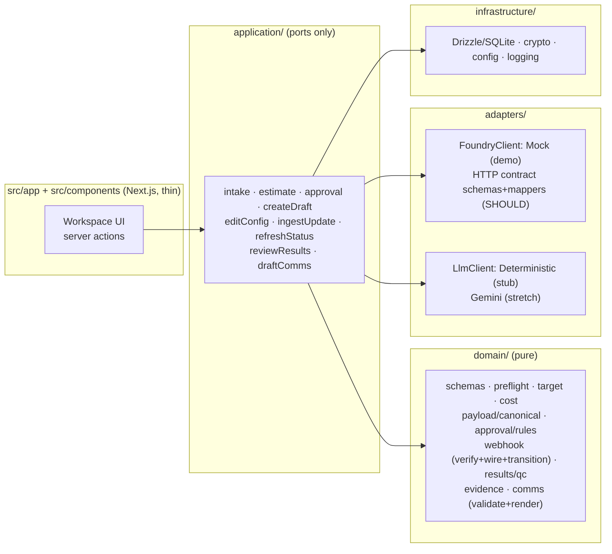

# FoundryOps

**FoundryOps is the safe operational layer around the Adaptyv Foundry API.** Paste an unstructured *BLI affinity characterization* request against EGFR and upload a FASTA, and FoundryOps produces a validated, budget‑aware Foundry **Draft** behind a human approval gate, ingests signed `experiment_update` messages into a trusted timeline and tracks experiment status separately (fetched via `getExperimentStatus`), runs deterministic results QC, and drafts an evidence‑backed customer update whose every number is inserted by the renderer from evidence — never by the model.

The thesis it demonstrates: **the model interprets ambiguity; deterministic software enforces truth, permissions, numbers, and state.** It runs fully offline in mock mode — no credentials, no network.

## Demo

- **Loom (4–5 min):** _<!-- LOOM_LINK_PLACEHOLDER: paste the recording URL here -->_

| Stage | Screenshot |
|---|---|
| Intake + preflight + remediation | `docs/screenshots/01-intake.png` _(placeholder)_ |
| Approval boundary (payload summary + canonical hash) | `docs/screenshots/02-approval.png` _(placeholder)_ |
| Signed update timeline + audit | `docs/screenshots/03-timeline.png` _(placeholder)_ |
| Three‑layer results QC | `docs/screenshots/04-results.png` _(placeholder)_ |
| Evidence‑backed customer draft | `docs/screenshots/05-draft.png` _(placeholder)_ |

_Screenshots are regenerated from the scripted demo; raw sequences are never shown (candidate IDs and counts only)._

## 60‑second local setup

```bash
nvm use            # Node 22.23.1 LTS (see .nvmrc); this project is tested on fnm too
npm ci             # install from the committed lockfile — do not regenerate it
npm run demo       # http://localhost:3000  (add -p <port> if 3000 is taken)
```

Runs in mock mode by default (`LLM_PROVIDER=stub`, `FOUNDRY_MODE=mock`, `./data/foundryops.db`). Reset between takes: `rm -f data/foundryops.db data/foundryops.db-*`.

## Exact demo request and fixture

Paste this verbatim (the deterministic stub is keyed to it) and upload **`fixtures/demo.fasta`** (candidates AC‑1…AC‑8):

> Prepare a BLI affinity characterization against EGFR using the attached sequences, six‑point concentration series in triplicate. Keep it below the customer budget of $8,000, flag anything suspicious, and do not submit without my approval.

Full scene‑by‑scene walkthrough: **`docs/DEMO_RUNBOOK.md`**.

## Architecture

Layered TypeScript: pure `domain/` (validation, arithmetic, hashing, authorization, QC, evidence, rendering) with no framework or I/O; `application/` orchestrates use‑cases and owns SQLite transactions and depends only on ports; `adapters/` wraps Foundry and the LLM behind typed interfaces; `infrastructure/` holds Drizzle/SQLite, crypto, config; `src/app` + `src/components` are the thin Next.js presentation layer.



## LLM vs deterministic responsibility boundary

The LLM may **only** (a) propose a `RawExtractedIntent` from the request text, and (b) compose customer‑draft **segments that reference evidence by id**. It never validates sequences, computes metrics, resolves approval policy, decides state transitions, invents values, executes Foundry operations, or writes a numeric value into prose. **No raw residues are ever sent to the LLM.** Everything load‑bearing — preflight, target resolution, cost arithmetic, canonical hashing, authorization, QC classification, evidence resolution, and number rendering — is deterministic code. The default `DeterministicLlmAdapter` is keyed to the exact demo request and returns reproducible fixtures; an unknown request returns `NO_STUB_FIXTURE` rather than a fabricated intent.

## Guarantees

- **Human approval, server‑authoritative.** Creating a Draft consumes a fully‑valid, non‑expired approval bound to `requestId + operation + environment + payloadVersion + payloadHash + costSnapshotMinor + status`. Server actions accept only ids; the payload is loaded server‑side (never trusted from the browser). Live mutations are non‑constructable without `FOUNDRY_MODE=live` + a server token.
- **Atomic config edit.** Editing the assay (e.g. replicates) runs one SQLite transaction that rebuilds the authoritative payload, bumps the version, recomputes the canonical hash, **invalidates all valid approvals**, and moves the request out of the ready state — so a prior approval is unusable even if draft creation is called directly, with no observable intermediate ready window.
- **Idempotency.** A Draft is keyed by `operationKey = requestId::operation::payloadHash` behind a unique index; a repeat returns the stored deterministic id. No reliance on an unverified provider `Idempotency-Key`.
- **Webhook integrity.** A signed `experiment_update` is HMAC‑verified over the **raw bytes** first, then JSON‑parsed, header/body cross‑checked, and validated in full against an exact Zod wire schema before persistence; deliveries are de‑duplicated by `delivery_id`. The webhook carries **no status** — experiment status is fetched separately via `getExperimentStatus`, mapped wire→domain, then run through a rank‑based transition policy. A signed‑but‑invalid envelope is audit‑only.
- **Evidence faithfulness (fail‑closed).** Every number in the customer draft is renderer‑inserted from an `EvidenceRecord`. Validation blocks a digit in any text/prefix/suffix segment, a missing evidence id, or an incompatible `claimType` (a `confirmed` claim cannot cite an `inconclusive` classification; recommendations require `approved_recommendation` evidence). Rendering never happens unless validation passes.
- **QC honesty.** `dataQuality ∈ {pass, warning, fail}` is kept separate from the binding **outcome**; replicate consistency and fit quality render as **not applicable** when no KD exists (a valid "no detectable binding" is not a failed assay).

## Verification

```bash
npm run verify      # typecheck · unit+integration tests · production build · client-bundle secret grep · npm audit
npm run test:e2e    # Playwright drives the full scripted demo flow (separate ./data/e2e.db, wiped per run)
npm run secret:scan # full gitleaks git-history secret scan (required dev tool)
npm run demo-ready  # verify + secret:scan + test:e2e
```

**Current evidence (this branch):** `npm run demo-ready` is green — **112 unit + integration tests across 27 files** (including a **golden/adversarial eval suite**, where a meta‑test enforces ≥10 adversarial cases), production build clean, client‑bundle secret grep 0 hits, a **gitleaks 8.30.1 git‑history scan** (46 commits, no leaks), the **Playwright end‑to‑end demo journey**, and `npm audit --audit-level=high` (0 high‑severity findings) — all run locally on this branch head. Separately: an independent hosted CI audit validated the earlier base commit `3415969`; it did not run on this branch head.

## Contract‑faithful vs synthetic

- **Contract‑faithful:** the Foundry request/response shapes are pinned to a downloaded OpenAPI snapshot (`src/adapters/foundry/contract/openapi.snapshot.json`, api version `0.0.2`) with Zod contract schemas + wire→domain mapper tests; the `experiment_update` webhook envelope, `X‑Adaptyv‑*` headers, and `sha256=<hmac>` signature match the documented contract; BLI result fields (KD, kon, koff, `rmse_max_signal_pct`, `fit_quality`, `confidence`) are the documented ones.
- **Synthetic (clearly labelled):** all sequences, candidates, measurements, quotes, IDs, and webhook deliveries are generated demo fixtures. QC thresholds are a **Demo QC Policy v1**, explicitly not Adaptyv production thresholds. Costs use a synthetic price model.

## Limitations and stretch integrations

- **Frozen scope:** one BLI affinity / EGFR story; request text + FASTA only; single‑user local; offline mock is the required path.
- **Stretch, disabled by default, behind typed interfaces:** the **Gemini** LLM adapter (`@google/genai`) and an **executable live Foundry HTTP client**. The real Foundry client currently ships as the pinned snapshot + contract schemas + mapper tests, not executable live calls.
- **Not in scope:** additional experiment types, authentication, deployment infrastructure, sending email/Slack.
- `gitleaks` is a required dev tool for `secret:scan`/`demo-ready` (install from <https://github.com/gitleaks/gitleaks>); no bypass is configured.

## Development process

This repository began as a planning‑first workspace and was built with Claude Code + the Superpowers workflow (brainstorming → written spec → implementation plan → subagent‑driven TDD → verification → review). That process, the planning documents, and the design/plan of record are documented in **`docs/DEVELOPMENT_PROCESS.md`** and under `docs/superpowers/`.
