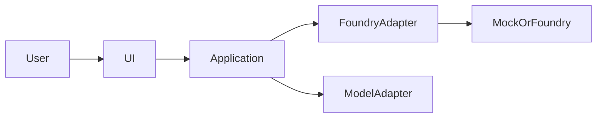

# Architecture proposal

**Status:** draft

This file is intentionally a template. Populate it only after the architecture proposal is reviewed.

## 1. Executive decision

## 2. Context and constraints

## 3. MVP boundary

## 4. Alternatives considered

## 5. System context

Replace this placeholder with the approved diagram.

## 6. Component responsibilities

## 7. Domain model and state machines

## 8. Request and event flows

## 9. LLM boundary and structured outputs

## 10. Foundry adapter and contract strategy

## 11. Persistence model

## 12. Security and approval model

## 13. Observability and auditability

## 14. Testing and evaluation strategy

## 15. Deployment and fallback mode

## 16. Risks and mitigations

## 17. Decision gates
